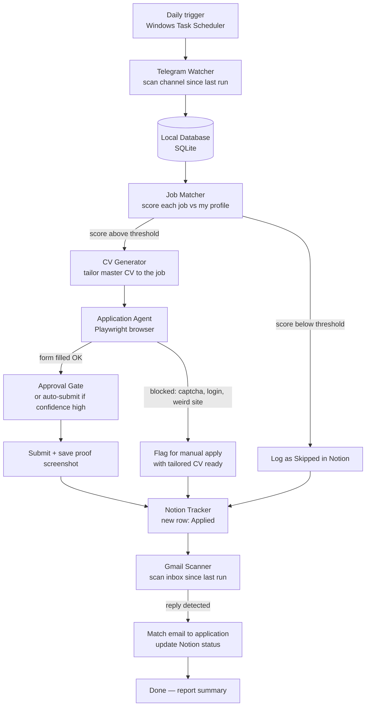

# Job Auto-Applier — Build Plan

An autonomous agent that scans a Telegram channel for job posts, applies to the ones
that match my profile, tracks everything in a colorful Notion database, and scans
Gmail for company responses — running on a daily schedule.

---

## The Big Picture




## Core design decisions

1. **Playwright first, vision as fallback.** Form-filling uses the page's real HTML
  (reliable, fast). Only if a site is impossible do we fall back to
   screenshot-based reasoning.
2. **Cursor SDK is the brain.** Every step that needs judgment (matching, CV
  tailoring, form understanding, email classification) calls a Cursor agent
   running locally via `cursor-sdk`. Deterministic steps (fetching messages,
   saving to DB, Notion API calls) are plain Python — cheaper and more reliable.
3. **Never edit the master CV.** Every application gets a freshly generated PDF
  from the master template. Tailored, never fabricated.
4. **Everything is resumable.** A `state.json` stores the last-scanned Telegram
  date and last-scanned Gmail date. Crash mid-run? Next run picks up cleanly.
   No job gets applied to twice (dedup by link + company + title).
5. **Confidence gates.**
  - High confidence → fill and submit automatically.
  - Medium → fill everything, stop before Submit, notify me for approval.
  - Low / blocked (captcha, account wall) → mark "Manual Apply Needed" in
  Notion with the tailored CV path so I can do it in 2 minutes myself.

## Build phases (each one works on its own)


| Phase                    | What gets built                                                                   | What you can do after it                                    |
| ------------------------ | --------------------------------------------------------------------------------- | ----------------------------------------------------------- |
| **0. Scaffold**          | Project structure, config, profile templates                                      | Fill in your profile files                                  |
| **1. Telegram Watcher**  | Connects to the channel, extracts jobs (company, title, skills, link) into SQLite | See every job neatly structured, no more scrolling Telegram |
| **2. Job Matcher**       | Scores every job against `about_me.md` (0–100 + reasons)                          | Get a daily shortlist of jobs worth applying to             |
| **3. CV Generator**      | Your Python PDF template + AI tailoring per job                                   | One command = tailored PDF for any job                      |
| **4. Notion Tracker**    | Colorful database: status pills, match scores, timeline, company info             | The presentation-worthy dashboard                           |
| **5. Application Agent** | Playwright agent that opens the link, understands the form, fills it, uploads CV  | Applications happen while you watch                         |
| **6. Gmail Scanner**     | Reads inbox since last run, matches replies to applications, updates Notion       | Response tracking on autopilot                              |
| **7. Scheduler + SDK**   | Cursor SDK orchestration + Windows Task Scheduler daily run                       | The full legendary autonomous loop                          |


## Project structure

```
Job auto applyer/
├── PLAN.md                  ← this file
├── README.md
├── requirements.txt
├── .env.example             ← template for secrets (real .env is git-ignored)
├── profile/
│   ├── about_me.md          ← who I am, what I want (the agent's brain about me)
│   ├── master_cv.md         ← single source of truth for CV content
│   └── answers.md           ← reusable answers to common application questions
├── src/
│   ├── main.py              ← daily run entry point (orchestrator)
│   ├── state.py             ← last-scanned dates, resumability
│   ├── db.py                ← SQLite: jobs, applications, dedup
│   ├── telegram_watcher.py  ← Phase 1
│   ├── matcher.py           ← Phase 2 (calls Cursor SDK)
│   ├── cv_generator.py      ← Phase 3 (PDF from template)
│   ├── notion_tracker.py    ← Phase 4
│   ├── applier/
│   │   ├── browser.py       ← Playwright tools (click, type, upload…)
│   │   └── agent.py         ← Phase 5 (AI decides, tools execute)
│   └── gmail_scanner.py     ← Phase 6
├── prompts/                 ← the instructions each AI step receives
│   ├── extract_job.md
│   ├── match_job.md
│   ├── tailor_cv.md
│   ├── fill_form.md
│   └── classify_email.md
├── output/
│   ├── cvs/                 ← generated PDFs, one per application
│   └── screenshots/         ← proof of each submission
└── data/
    ├── jobs.db              ← SQLite (git-ignored)
    └── state.json           ← last scan dates (git-ignored)
```

## Notion tracker design (Phase 4)

One database, styled for presentation:


| Property         | Type                   | Notes                                                                                                            |
| ---------------- | ---------------------- | ---------------------------------------------------------------------------------------------------------------- |
| Company          | Title                  | with company domain icon when available                                                                          |
| Role             | Text                   |                                                                                                                  |
| Status           | Select (colored pills) | 🔵 Found → 🟡 Applying → 🟢 Applied → 🟣 Interview → 🏆 Offer / 🔴 Rejected / ⚪ Skipped / 🟠 Manual Apply Needed |
| Match Score      | Number (%)             | with color-coded formula bar                                                                                     |
| Match Reasons    | Multi-select           | skills that matched, e.g. `Python` `Remote` `Junior`                                                             |
| Source Link      | URL                    | original application link                                                                                        |
| Applied Date     | Date                   |                                                                                                                  |
| CV Used          | Text                   | filename of the tailored PDF                                                                                     |
| Last Response    | Date                   | updated by Gmail scanner                                                                                         |
| Response Summary | Text                   | AI one-liner of the company's email                                                                              |
| Salary           | Text                   | if the post mentioned it                                                                                         |
| Location         | Select                 | Remote / Hybrid / city                                                                                           |


Plus gallery + board views (grouped by Status) so it looks great in a demo.

## Daily run timeline (Phase 7, the end state)

1. Task Scheduler fires at the configured time.
2. Telegram watcher pulls all posts since `state.last_telegram_scan`.
3. Each post → extracted → deduped → scored.
4. For every match above threshold: tailor CV → open link → fill → submit
  (or stop for approval / flag as manual, per confidence).
5. Every outcome lands in Notion with a screenshot.
6. Gmail scanner reads inbox since `state.last_gmail_scan`, matches replies to
  applications, updates Notion statuses.
7. `state.json` updated, summary printed/notified. Done.

## Credentials needed (all free)


| Credential                     | Used in phase | Where to get it                         |
| ------------------------------ | ------------- | --------------------------------------- |
| Telegram `api_id` + `api_hash` | 1             | my.telegram.org → API development tools |
| Notion integration token       | 4             | notion.so/my-integrations               |
| Gmail OAuth (read-only)        | 6             | Google Cloud Console (guided setup)     |
| `CURSOR_API_KEY`               | 2+            | cursor.com/dashboard → Integrations     |


